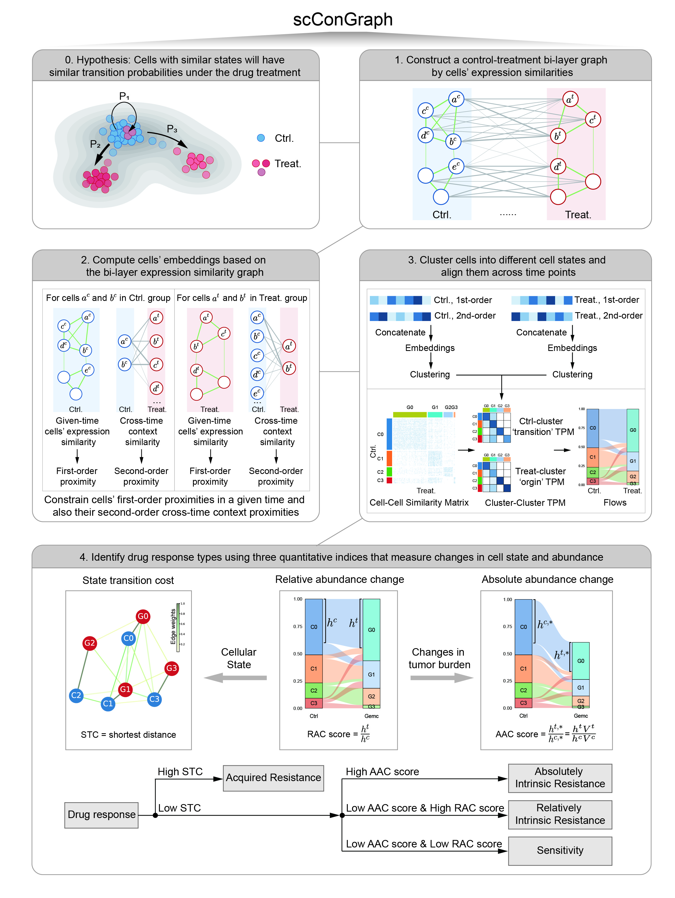

# scConGraph: a scalable cross-time Context Graph model
scConGraph is a scalable bi-layer graph model that efficiently **integrates cross-time context information**, enabling the comprehensive analysis of **tumor cell dynamic responses** from **paired perturbed or time-seiries single-cell transcriptomics**.

<p align="center">
  
</p>

## System requirements
scConGraph is currently **available for Linux systems**, as it relies on **LINE**, a `C++`-based embedding method that depends on the GSL package for Linux. If you use the downstream analysis functions in `scConGraph`, which are implemented in Python, there are no system restrictions.

Tested System Configuration:
``` yaml
OS: Linux 3.10.0-1160.el7.x86_64
Python Version: 3.9.19
Processor: x86_64
CPU Cores: 36
Logical CPUs: 36
Total RAM (GB): 251.38
```

## Installation
scConGraph requires `python` version 3.7+.  Install directly via pip:
``` Python
pip install scConGraph
``` 
#### Alternative Installation
If you prefer not to install `scConGraph`， you can download the script directly from the GitHub repository: [scConGraph/scConGraph.py](https://github.com/Li-Xinqi/scConGraph/blob/main/scConGraph/scConGraph.py). Then, manually import the module in your Python environment:
```Python
import sys
sys.path.append('./scConGraph-main/scConGraph/')
import scConGraph as scg
```
#### Required Dependencies
**Importantly**, the LINE toolkit (LINUX version) must be downloaded and installed from LINE GitHub Repository (https://github.com/tangjianpku/LINE.git) **before using scConGraph**. 

## **Tutorial**
The vignette of `scConGraph` can be found in the project [Wiki](https://github.com/Li-Xinqi/scConGraph/wiki).

## Codes for PDAC Drug Response Analysis
The R scripts used for analyzing drug responses are located in the Analysis/Codes folder. The raw and intermediate data are stored in the Analysis/Data folder. Larger datasets are saved on the [cloud](https://cloud.tsinghua.edu.cn/d/63ff224544874971b0dd/).  
If you have any questions about the codes, please contact the [author](lxq19@mails.tsinghua.edu.cn).
